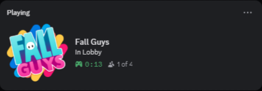
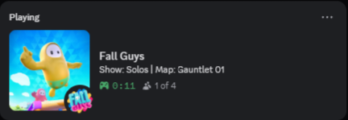
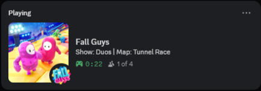
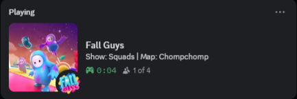
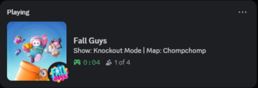
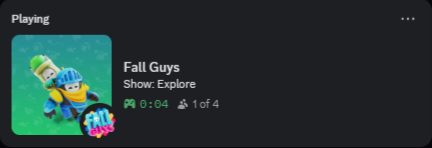

# Fall-Guys-RPC

[](https://www.microsoft.com/windows)
[](https://store.steampowered.com/app/1097150/Fall_Guys)
[](https://store.epicgames.com/p/fall-guys)
[](https://www.python.org)
[](https://discord.gg/tCWRxbmAwp)

Simple Discord Rich Presence for Fall Guys on Steam and Epic Games.

## Features

- Runs as a tray app with Open and Close controls
- Supports both Steam and Epic Games versions of Fall Guys
- Checks the Fall Guys log file every 5 seconds
- Clears Discord Rich Presence when Fall Guys is not running
- Shows "In Lobby" while waiting in the Fall Guys lobby
- Shows "Selecting next round" between rounds instead of falling back to lobby too early
- Shows the current show and map in-game, for example `Show: Solos | Map: Door Dash`
- Hides the map for Explore and Creator Spotlight to avoid showing stale or misleading round names
- Uses Discord's party-size display as `(x of y)` instead of showing players alive
- Uses matching show icons for known shows like Solos, Duos, Squads, Knockout, Ranked Knockout, Creator Spotlight, and Explore
- Automatically formats raw Fall Guys show and round IDs into readable names
- Writes live app logs to help troubleshoot Discord or Fall Guys detection issues

## Discord Preview

| Lobby | Solos |
| --- | --- |
|  |  |

| Duos | Squads |
| --- | --- |
|  |  |

| Knockout | Ranked Knockout |
| --- | --- |
|  |  |

| Creator Spotlight | Explore |
| --- | --- |
|  |  |

| Selecting Next Round | Waiting for Fall Guys |
| --- | --- |
| Placeholder: add `assets/Selecting_Next_Round.png` | Placeholder: add `assets/Waiting_For_Fall_Guys.png` |

## Download / Install

### 1. EXE (Recommended)

Download the EXE from the [latest release](https://github.com/itsfatlum/Fall-Guys-RPC/releases/latest) and open it.

After launch, use the tray icon to open logs or close the app.

### 2. Manual Installation (Python)

Install dependencies:

```powershell
pip install -r requirements.txt
```

Run from source:

```powershell
python main.py
```

## Build EXE

```powershell
pyinstaller --noconfirm --clean --distpath . Fall-Guys-RPC.spec
```

The built EXE will be created at `Fall-Guys-RPC.exe`.

## Logs

Live logs are available from the tray menu and stored at:

```text
C:/Users/<your-user>/AppData/Local/Fall-Guys-RPC/rpc.log
```

## Troubleshooting

If status does not update on Discord:

- Ensure Discord desktop app is running
- Ensure Fall Guys is running
- Open tray icon menu and click Open to view live logs
- Check the log file path shown above

## Known Issues

- Maps may sometimes display the wrong name because the app reads the latest useful round entry from the Fall Guys log.
- Limited-time modes may not always be detected correctly if Fall Guys uses a new or unusual show ID.
- Fall Guys detection expects the default Windows Fall Guys log location used by Steam and Epic Games. If your setup stores `Player.log` somewhere else, the app may not detect the game correctly.

## Contributing

If you notice a wrong show name, map name, icon, or lobby/game status, you can help improve detection by joining the Discord support server.

Please upload your app logs and describe what looked wrong, for example:

- Which show or mode you were playing
- What Discord displayed
- What Discord should have displayed
- Whether you were in the lobby, loading, in-game, or between rounds

Logs are stored here:

```text
C:/Users/<your-user>/AppData/Local/Fall-Guys-RPC/rpc.log
```

## Support

If you need help, join the support server:

https://discord.gg/tCWRxbmAwp

## FAQ

<details>
<summary>What does Fall-Guys-RPC do?</summary>

Fall-Guys-RPC shows your current Fall Guys status on Discord using Rich Presence. It can show when you are in the lobby, which show you are playing, the current map when available, and your party size.

</details>

<details>
<summary>Does this support Epic Games?</summary>

Yes. Steam and Epic Games both use the same Fall Guys log location on Windows:

```text
C:/Users/<your-user>/AppData/LocalLow/Mediatonic/FallGuys_client/Player.log
```

The default Epic Games install path, `C:/Program Files/Epic Games/FallGuys`, does not change where the live Fall Guys log is written.

</details>

<details>
<summary>Does this modify Fall Guys?</summary>

No. The app only reads the Fall Guys log file and sends status information to Discord. It does not edit game files or interact with the game process.

</details>

<details>
<summary>Does this need administrator permissions?</summary>

Usually no. You should be able to run it normally. If Discord or Fall Guys is running in an unusual permission setup, running all apps at the same permission level can help.

</details>

<details>
<summary>How often does the Discord status update?</summary>

The app checks the Fall Guys log file every 5 seconds.

</details>

<details>
<summary>Why does the party size show as "(x of y)"?</summary>

Discord Rich Presence shows party size next to the people icon. This app uses that field for your party size, not for players alive in the round.

</details>

<details>
<summary>Why does it not show players alive?</summary>

The app is focused on party size because Discord has a built-in party size display. Players alive can be unreliable from logs and can make the Discord status confusing.

</details>

<details>
<summary>Can Show and Map be displayed on separate lines?</summary>

Discord Rich Presence does not reliably support custom line breaks in the same field. The app keeps the display compact and predictable by showing the current show and map together when Discord allows it.

</details>

<details>
<summary>Why is the map hidden in Explore?</summary>

Explore can rotate through different community rounds, so the app only shows the Explore show name there to avoid displaying a wrong or confusing map.

</details>

<details>
<summary>Where can I find the app logs?</summary>

Use the tray icon and click Open, or open this file:

```text
C:/Users/<your-user>/AppData/Local/Fall-Guys-RPC/rpc.log
```

</details>

<details>
<summary>Why does VirusTotal or antivirus software sometimes flag the EXE?</summary>

The EXE is built with PyInstaller as a single-file app. Some antivirus engines flag new or unsigned bundled Python apps with generic detections.

The current v0.1.0 test scan is available here:

https://www.virustotal.com/gui/file/007eb44473e7a9d7e480229024dff273b15453c2cd24bd256738a1254457ff28?nocache=1

You can also run the app from source with Python if you prefer.

</details>

<details>
<summary>Can I run it from source instead of using the EXE?</summary>

Yes. Install the requirements and run `main.py` with Python:

```powershell
pip install -r requirements.txt
python main.py
```

</details>

<details>
<summary>What should I do if Discord does not update?</summary>

Make sure the Discord desktop app is running, Fall Guys is open, and the RPC app is still running in the tray. Then check the logs from the tray menu.

</details>

<details>
<summary>How do I close the app?</summary>

Use the tray icon menu and click Close.

</details>
