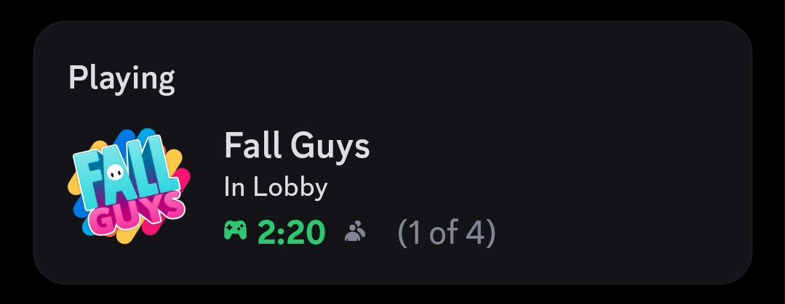

# Fall-Guys-RPC

[](https://www.microsoft.com/windows)
[](https://store.steampowered.com)
[](https://store.epicgames.com)
[](https://www.python.org)
[](https://discord.gg/tCWRxbmAwp)

Simple Discord Rich Presence for Fall Guys.

## Features



- Shows "In Lobby" with the Fall Guys icon when in the lobby
- Displays party size as "x of y" next to the people icon in the lobby
- Shows the correct show icon and name in-game (Solos, Duos, Squads, etc.)
- Displays the current show and map name in-game
- Displays party size as "x of y" instead of players alive
- Automatically formats show and map names for readability

## Download / Install

### 1. EXE (Recommended)

Run directly:

```powershell
Steam/Fall-Guys-RPC.exe
```

After launch, use the tray icon to open logs or close the app.

### 2. Manual Installation (Python)

Install dependencies:

```powershell
pip install -r Steam/requirements.txt
```

Run from source:

```powershell
python Steam/main.py
```

## Build EXE

```powershell
pyinstaller Fall-Guys-RPC.spec
```

Then move `dist/Fall-Guys-RPC.exe` into the `Steam` folder.

## Logs

Live logs are available from the tray menu and stored at:

```text
C:/Users/<your-user>/AppData/Local/Fall-Guys-RPC/rpc.log
```

## Troubleshooting

If status does not update on Discord:

- Ensure Discord desktop app is running
- Ensure Fall Guys is running
- Open tray icon menu and click Open to view live logs
- Check the log file path shown above

## Support

If you need help, join the support server:

https://discord.gg/tCWRxbmAwp

## FAQ

<details>
<summary>What does Fall-Guys-RPC do?</summary>

Fall-Guys-RPC shows your current Fall Guys status on Discord using Rich Presence. It can show when you are in the lobby, which show you are playing, the current map when available, and your party size.

</details>

<details>
<summary>Does this support Epic Games?</summary>

Not yet. The current version supports the Steam version of Fall Guys.

</details>

<details>
<summary>Does this modify Fall Guys?</summary>

No. The app only reads the Fall Guys log file and sends status information to Discord. It does not edit game files or interact with the game process.

</details>

<details>
<summary>Does this need administrator permissions?</summary>

Usually no. You should be able to run it normally. If Discord or Fall Guys is running in an unusual permission setup, running all apps at the same permission level can help.

</details>

<details>
<summary>How often does the Discord status update?</summary>

The app checks the Fall Guys log file every 5 seconds.

</details>

<details>
<summary>Why does the party size show as "(x of y)"?</summary>

Discord Rich Presence shows party size next to the people icon. This app uses that field for your party size, not for players alive in the round.

</details>

<details>
<summary>Why does it not show players alive?</summary>

The app is focused on party size because Discord has a built-in party size display. Players alive can be unreliable from logs and can make the Discord status confusing.

</details>

<details>
<summary>Can Show and Map be displayed on separate lines?</summary>

Discord Rich Presence does not reliably support custom line breaks in the same field. The app keeps the display compact and predictable by showing the current show and map together when Discord allows it.

</details>

<details>
<summary>Why is the map hidden in Explore?</summary>

Explore can rotate through different community rounds, so the app only shows the Explore show name there to avoid displaying a wrong or confusing map.

</details>

<details>
<summary>Where can I find the app logs?</summary>

Use the tray icon and click Open, or open this file:

```text
C:/Users/<your-user>/AppData/Local/Fall-Guys-RPC/rpc.log
```

</details>

<details>
<summary>Why does VirusTotal or antivirus software sometimes flag the EXE?</summary>

The EXE is built with PyInstaller as a single-file app. Some antivirus engines flag new or unsigned bundled Python apps with generic detections.

The current v0.1.0 test scan is available here:

https://www.virustotal.com/gui/file/065ea8c1d6054425621f02d0977a59920da786dffe25c59a27ea799b41567dbc?nocache=1

You can also run the app from source with Python if you prefer.

</details>

<details>
<summary>Can I run it from source instead of using the EXE?</summary>

Yes. Install the requirements and run `Steam/main.py` with Python:

```powershell
pip install -r Steam/requirements.txt
python Steam/main.py
```

</details>

<details>
<summary>What should I do if Discord does not update?</summary>

Make sure the Discord desktop app is running, Fall Guys is open, and the RPC app is still running in the tray. Then check the logs from the tray menu.

</details>

<details>
<summary>How do I close the app?</summary>

Use the tray icon menu and click Close.

</details>
